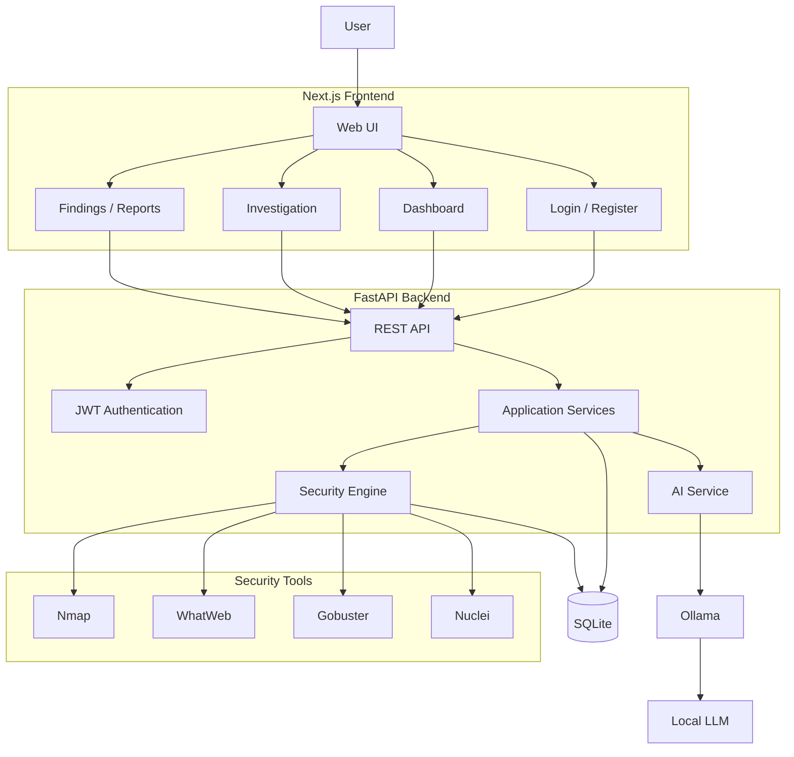

# Amyna

**An AI-assisted cybersecurity investigation platform for discovering, understanding, and learning from security vulnerabilities.**

[](https://nextjs.org/)
[](https://fastapi.tiangolo.com/)
[](https://www.sqlite.org/)
[](https://ollama.com/)
[](https://www.docker.com/)

Amyna is a cybersecurity investigation platform that brings reconnaissance, security tooling, vulnerability analysis, and AI-assisted explanations into one workflow.

The idea is simple: instead of jumping between different security tools and trying to understand raw terminal output, Amyna brings the results together and turns them into something easier to investigate, understand, and learn from.

> **Only use Amyna on systems you own or have explicit permission to test.**

---

## ✨ What Amyna Does

- 🔍 **Reconnaissance & Scanning** — Bring multiple security tools into a single investigation workflow.
- 🛠️ **Security Tool Integration** — Nmap, WhatWeb, Gobuster, and Nuclei are planned for the initial security engine.
- 🤖 **Local AI Analysis** — Use Ollama and a local LLM to explain security findings.
- 📖 **Learning-Oriented Findings** — Understand what a vulnerability means, why it matters, and how to fix it.
- 📊 **Investigation Dashboard** — Organize projects, investigations, findings, and reports.
- 🔐 **Authentication** — JWT-based user authentication and protected resources.
- 📄 **Security Reports** — Turn investigation results into structured security reports.
- 🐳 **Docker** — Containerized deployment is part of the planned production setup.

---

## 🏗️ Architecture

Amyna uses a Next.js frontend communicating with a FastAPI backend. The backend handles authentication, application logic, persistence, security-tool execution, and AI analysis.



The architecture is intentionally modular so new security tools, AI models, and application features can be added without rewriting the entire system.

More detailed architecture decisions are documented in [`docs/architecture.md`](docs/architecture.md).

---

## 🧰 Tech Stack

### Frontend

- Next.js
- TypeScript
- Tailwind CSS
- shadcn/ui
- Framer Motion

### Backend

- FastAPI
- Python
- SQLAlchemy
- Alembic

### Database

- SQLite

### Authentication

- JWT
- bcrypt
- python-jose

### Security Tooling

- Nmap
- WhatWeb
- Gobuster
- Nuclei

### AI

- Ollama
- Local LLMs

### Infrastructure

- Docker
- Docker Compose

---

## 🚀 Quick Start

### Backend

```bash
cd backend

python3 -m venv .venv
source .venv/bin/activate

pip install -r requirements.txt
```

Create your local environment file:

```bash
cp .env.example .env
```

Set the required values in `.env`.

Start the API:

```bash
uvicorn app.main:app --reload
```

The API will run at:

```text
http://localhost:8000
```

Swagger:

```text
http://localhost:8000/docs
```

### Frontend

Open another terminal:

```bash
cd frontend
npm install
npm run dev
```

The frontend will run at:

```text
http://localhost:3000
```


## 🧪 Testing

Backend tests can be run with:

```bash
pytest
```

API endpoints can also be tested through FastAPI's Swagger interface:

```text
http://localhost:8000/docs
```

---


## 🛠️ How Amyna Is Built

Amyna is an **AI-assisted development project**.

I use coding agents to help implement features, debug issues, refactor code, and explore different approaches. I review the generated code, test each step, make the architectural decisions, and use the project as a way to learn the systems behind it.

The project is being developed incrementally rather than generating the entire application in one shot. Features are broken into smaller milestones, implemented, tested, and committed separately.

The goal isn't to hide the use of AI. It's to explore what can be built when AI coding tools are used as part of an actual software development workflow.

---